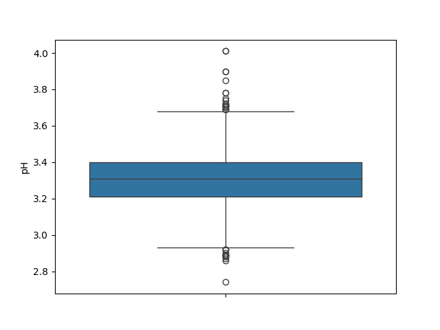

# 概要
外れ値を除去してから交差検証法、決定係数を用いてモデルの構築、評価を行う  

# 使用データ

データの出典([https://archive.ics.uci.edu/dataset/186/wine+quality])

データの形式(CSV,区切り文字;)

# 環境、依存ライブラリ
python(3.12.9),pandas,scikit-learn,matplotlib.pyplot,seaborn  

# データの前処理
説明変数のカラム別に箱ひげ図を出力する  
〇で表示された値が外れ値であるからこれを除去する  

下記の図は説明変数のカラムの一つであるpHについての箱ひげ図である  

# モデルの構築
交差検証法を用いるためのライブラリ(KFold,cross_val_score)をインポートする  

# モデルの評価
決定係数(R^2)を用いてモデルの精度の評価を行う  

